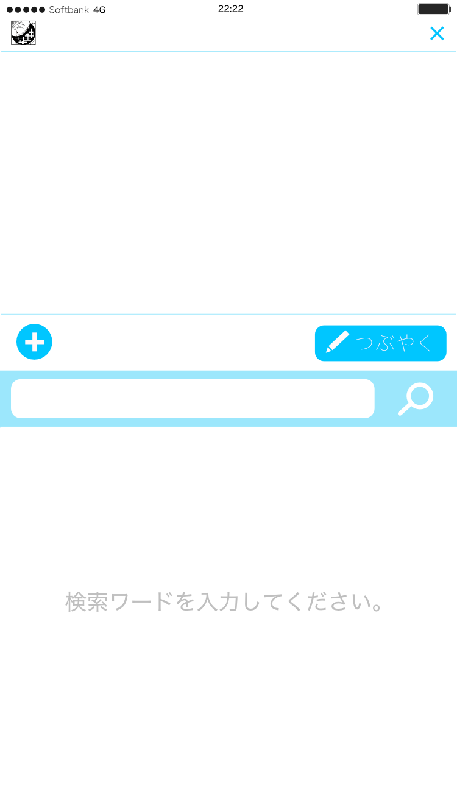

## iPhone App Idea Memo  
- Game
	- ルービックキューブ 
- Social
	- ニッチな分野を対象としたようなSNS
	- 例えばiPhoneの曲の再生回数情報を使って今一番聞かれている曲を表示できないか？
	- つまりApple Musicのソーシャル部分だけを抜き出す
- Music
- Photo
	- 顔認証を絡めたもの
	- パーティーなどで使える
	- ゲーム的な要素あり
	- 画像として残せてそれを各SNSにアップロードできる
- 席替えアプリ
	- いろんなかたちに対応できるのがいい
	- 例えばLiTでよくつかわれるアイランド型とかにも
	- 「目が悪い人」とかそういう感じのことにも柔軟に対応したい
	- 使いやすいUIかつ席替えアニメーションがあるといい
	- 最終的な席を画像にしてSNSにアップロードできるようにしたら使い道も広がりそう
- ネタ画像収集アプリ←有力候補、おもしろそう
	- 最低限の機能にTwitterでよく使われるネタ画像を手軽に使えるようにしたTwitterクライアント
	- 画像検索から直接とってくるところでいちいち自分の画像フォルダにストックしておく必要がない
	- APIについては[これ](http://qiita.com/daisy1754/items/92943169cb3438b1879e)を参考にするのがよさそう
	- 公式クライアントと同じような感覚で画像を一覧できたらベスト
	- 最低限の機能→TL閲覧、つぶやく、リプの閲覧、いいね、リツイート、リプ
	- ユーザープロフィールを見る機能やいいね・リツイートの通知はいらないのでカット
	- Twitterの扱いについては[ここ](http://himaratsu.hatenablog.com/entry/twitter/api)
	- タイトル案「ネタ☆リプ」、「funny tweet」、「Imagenius」、「イマジニアス」、
	- 